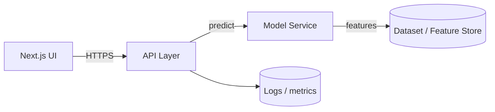

# Capstone — AI Finance Prediction App (Team)

## Problem & users

Our capstone team built a workflow that helps users explore financial signals and generate predictions with transparent evaluation and practical safeguards. The goal was to make experimentation understandable, not “black box”.

## My role & responsibilities

- Owned ML evaluation approach and baseline comparisons
- Defined the API contract between the model layer and the web UI
- Implemented features end‑to‑end (data → API → UI) and documented trade‑offs

## Key features

- Data pipeline with repeatable preprocessing steps
- Metrics + baseline comparison (placeholders until final model is locked)
- Simple UI for running predictions and reviewing results
- Guardrails: display uncertainty, avoid overconfident wording

## Tech stack

- Python (Pandas / notebooks for exploration)
- Model training + evaluation (team-owned)
- Next.js + TypeScript for UI

## Architecture (high level)

## Security & privacy considerations

- Keep model artifacts versioned and controlled (no ad-hoc uploads)
- Validate inputs; don’t allow arbitrary code execution paths
- If any user data exists: encrypt at rest and restrict access

## Deployment pipeline (CI/CD + hosting)

- Preview deploys for UI on PRs
- Automated checks for type/lint
- Model version pinning per release tag

## Database / data layer

Depending on the final scope, Postgres (Supabase/Neon) can store:

- experiment runs (inputs, model version, metrics)
- user accounts (if required)
- audit logs for prediction requests

## Challenges & what I learned

- How to present ML output responsibly (uncertainty + baselines)
- Aligning a team on “done”: metrics, UX, and deployment reliability

## Next steps

- Finalize model selection and publish metric tables
- Add automated evaluation in CI (regression checks)
- Improve explainability and reporting exports

